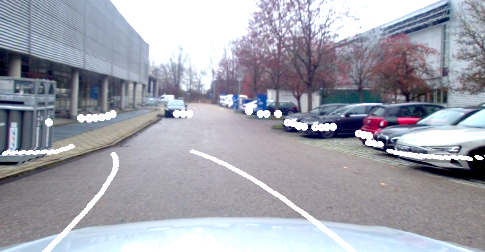

# tod_projection

This ROS package provides nodes to project the vehicle's motion as lanes and laser scans into camera images.


### Dependencies
  * ROS Packages:
    * roscpp
    * sensor_msgs
    * nav_msgs
    * tf2_ros
    * tod_msgs
    * tod_helper_functions
    * tod_projection_helper
    * tod_vehicle_config (exec only)
  * Third Party:
    * [OpenCV](https://opencv.org/)
      ```
      sudo apt-get install libopencv-dev
      ```


### Documentation
The nodes of the package and their functionalities are documented in the README under `src/`. 


### Quick Start
  * Follow the instructions in the container repository [teleoperated_driving](https://github.com/TUMFTM/teleoperated_driving)
  to clone and initialize the submodules.
  * Create the config of your camera and lidar sensors, following the instructions in the
  [tod_vehicle_config](https://github.com/TUMFTM/tod_vehicle_interface/tree/master/tod_vehicle_config) package. Set `project_on: true` for the cameras, which videos you want to be projected on. 
  * Install the `tod_projection` dependencies and those of the required `tod_*` packages (see above).
  * Build and source the workspace.
    ```
    catkin build tod_projection && source devel/setup.bash # or `setup.zsh`, depending on your shell
    ```
  * Set your `vehicleID` in the `tod_projection.launch` and launch the nodes.
    ```
    roslaunch tod_projection tod_projection.launch
    ```
  * Vehicle lanes are published when vehicle data is received. Videos are projected if data to be projected (vehicle lanes or laser scans) are received, and the connection to the vehicle is established. 
  * To simulate a connection to the vehicle, execute the following command, publishing the status message, in a separate terminal.
    ```
    rostopic pub -r 10 /Operator/Manager/status_msg tod_msgs/Status '{tod_status: 1}'
    ```


### Example
An example of the projection result of the vehicle lanes and a front laser scan is shown below. 

